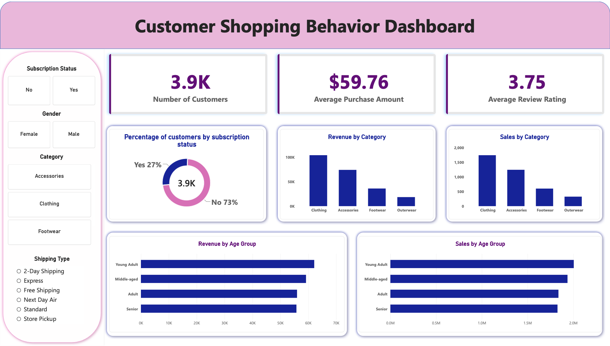

# Data Analytics Project

## Overview

This project demonstrates an end-to-end data analytics workflow, from loading and exploring raw data to extracting insights using Python and SQL, and presenting findings through an interactive Power BI dashboard and supporting reports.

The project focuses on data cleaning, exploratory data analysis, SQL querying, data visualisation, and communicating business insights in a clear and practical way.

---

## Dataset

The project uses a structured dataset containing customer/business-related information for analysis.

The dataset is initially loaded and explored using Python to understand:

* Dataset structure and dimensions
* Data types
* Missing values
* Duplicate records
* Outliers and unusual values
* Categorical and numerical variables
* Key patterns and relationships within the data

The raw dataset is retained separately from the cleaned dataset to maintain a clear and reproducible workflow.

---

## Tools & Technologies

| Tool                     | Purpose                                              |
| ------------------------ | ---------------------------------------------------- |
| **Python**               | Data loading, cleaning and exploratory data analysis |
| **Pandas**               | Data manipulation and preprocessing                  |
| **Matplotlib / Seaborn** | Data visualisation during EDA                        |
| **PostgreSQL**           | SQL analysis and querying                            |
| **MySQL**                | SQL analysis and querying                            |
| **SQL Server**           | SQL analysis and querying                            |
| **Power BI**             | Interactive dashboard and data visualisation         |
| **Gamma**                | Presentation / PowerPoint creation                   |
| **Microsoft Excel**      | Initial data inspection and supporting analysis      |

---

## Project Workflow

### 1. Load the Dataset

The dataset is imported into Python using Pandas.

Initial checks are performed to understand:

* Number of rows and columns
* Column names
* Data types
* Missing values
* Duplicate records
* Basic statistics

### 2. Exploratory Data Analysis

EDA is performed to identify patterns, trends and relationships in the data.

This includes:

* Descriptive statistics
* Distribution analysis
* Frequency analysis
* Correlation analysis
* Group-based analysis
* Visual exploration of important variables

The findings from EDA are used to identify potential data quality issues and areas requiring further investigation.

### 3. Data Cleaning

The raw data is cleaned and prepared for analysis.

Key steps include:

* Handling missing values
* Removing duplicate records where appropriate
* Correcting data types
* Standardising categorical values
* Checking inconsistent records
* Identifying and investigating outliers
* Creating derived fields where required

The cleaned dataset is then used for the SQL and Power BI stages.

### 4. SQL Analysis

The cleaned data is loaded into relational databases and analysed using SQL.

SQL queries are developed using:

* **PostgreSQL**
* **MySQL**
* **SQL Server**

The analysis includes queries using techniques such as:

* `SELECT` and filtering
* `GROUP BY`
* Aggregate functions
* `JOIN`
* `CASE`
* Subqueries
* Common Table Expressions (CTEs)
* Window functions
* Sorting and ranking

The objective is to answer relevant analytical and business questions from the dataset.

### 5. Power BI Dashboard

The analysed data is connected to Power BI to create an interactive dashboard.

The dashboard includes relevant:

* KPIs
* Charts
* Tables
* Filters and slicers
* Trend analysis
* Category comparisons
* Interactive visualisations

The dashboard is designed to allow users to explore the data and quickly identify important trends and insights.

### 6. Report

A supporting analytical report is created to document:

* Project objectives
* Data preparation
* EDA findings
* SQL analysis
* Key insights
* Business implications
* Recommendations

The report provides additional context behind the dashboard and analysis.

### 7. Presentation

A PowerPoint presentation is created using Gamma to communicate the project findings in a concise and visually engaging format.

The presentation covers:

* Business problem
* Dataset
* Methodology
* Key analysis
* Important findings
* Dashboard
* Recommendations
* Conclusion

---

## Dashboard

The Power BI dashboard provides an interactive overview of the most important metrics and findings from the analysis.

Users can interact with filters and visualisations to explore different segments of the dataset and identify trends.

**Dashboard Preview:**

[](Customer_Behavior_Analysis_Dashboard_PowerBI.png)

---

## Key Results

The analysis identifies several important patterns and insights within the dataset.

Key findings include:

* Identification of the most important trends and categories
* Comparison of performance across different segments
* Identification of areas with unusual or inconsistent behaviour
* Analysis of relationships between relevant variables
* Development of data-driven recommendations

The final results are presented through the Power BI dashboard, analytical report and presentation.

---

## Project Structure

```text
data-analytics-project/
│
├── data/
│   ├── raw/
│   └── cleaned/
│
├── python/
│   └── data_analysis.ipynb
│
├── sql/
│   ├── postgresql/
│   ├── mysql/
│   └── sql_server/
│
├── powerbi/
│   └── dashboard.pbix
│
├── report/
│   └── analysis_report.pdf
│
├── presentation/
│   └── project_presentation.pptx
│
└── README.md
```

---

## How to Run

### Python

1. Clone or download this repository.
2. Install the required Python libraries:

```bash
pip install pandas numpy matplotlib seaborn jupyter
```

3. Open the Jupyter Notebook:

```bash
jupyter notebook
```

4. Run the analysis notebook from start to finish.

### SQL

1. Install or access PostgreSQL, MySQL and/or SQL Server.
2. Create the required database.
3. Import the cleaned dataset.
4. Run the SQL scripts provided in the corresponding folders.
5. Review the query results and insights.

### Power BI

1. Open the `.pbix` file in Power BI Desktop.
2. Update the data source if required.
3. Refresh the dataset.
4. Use the dashboard filters and visualisations to explore the results.

---

## Skills Demonstrated

This project demonstrates practical experience in:

* Data Cleaning
* Exploratory Data Analysis
* Python
* Pandas
* SQL
* PostgreSQL
* MySQL
* SQL Server
* Data Visualisation
* Power BI
* Dashboard Development
* Data Storytelling
* Business Analysis
* Reporting and Presentation

---

## Conclusion

This project demonstrates an end-to-end approach to data analytics, combining **Python, SQL and Power BI** to transform raw data into meaningful insights.

It highlights the ability to work with data from initial exploration and cleaning through to SQL analysis, dashboard development, reporting and presentation of findings.

